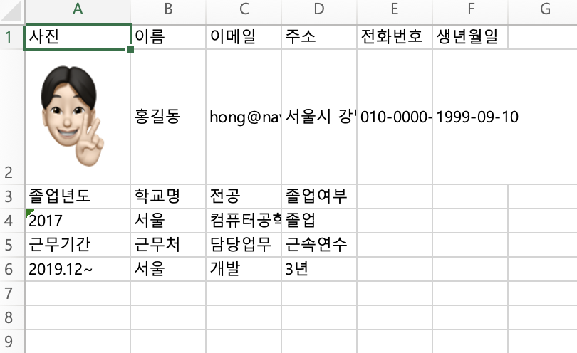

# 이력서 자동생성 프로그램
- 이력 정보와 자기소개서를 입력 받아서 Excel 파일을 생성하는 프로그램

---

````
사진 파일명을 입력하세요:me.png
이름을 입력하세요:홍길동
이메일을 입력하세요:hong@naver.com
주소를 입력하세요:서울시 강남구
전화번호를 입력하세요:010-0000-1111
생년월일을 입력하세요 (예: 1990-01-01):1999-09-10
학력 정보를 입력하세요 (종료는 q):
졸업년도 학교명 전공 졸업여부
2017 서울 컴퓨터공학과 졸업
학력 정보를 입력하세요 (종료는 q):
졸업년도 학교명 전공 졸업여부
q
경력 정보를 입력하세요 (종료는 q):
근무기간 근무처 담당업무 근속연수
2019.12~ 서울 개발 3년
경력 정보를 입력하세요 (종료는 q):
근무기간 근무처 담당업무 근속연수
q
자기소개서를 입력하세요. 여러 줄을 입력하려면 빈 줄을 입력하세요.
저는 올해 초등학교 6학년인 남자아이와 4학년인 여자아이를 자녀로 두고 있는 42살의 14년차 전업주부 OOO입니다.
````


